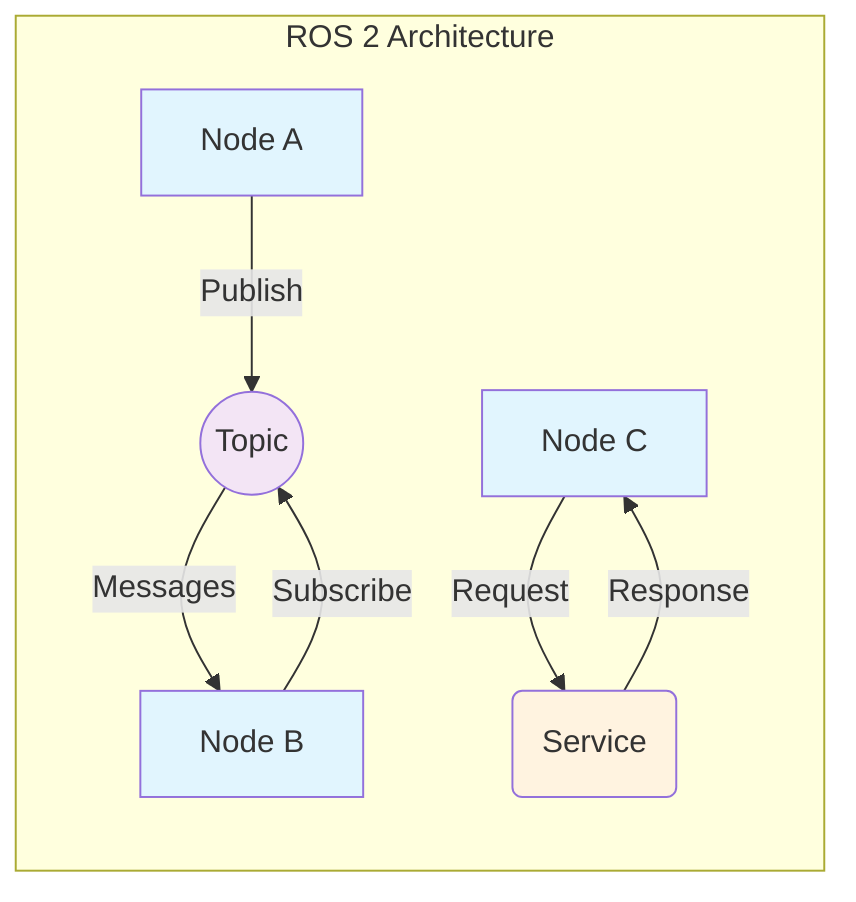

# ROS 2 Core Concepts

## Learning Objectives

By the end of this chapter, you will be able to:
- Explain the fundamental concepts of ROS 2: Nodes, Topics, and Services
- Identify the roles of each component in a ROS 2 system
- Create and run basic publisher and subscriber nodes
- Understand the request-response pattern of ROS 2 services
- Run and test the provided code examples

## Prerequisites

Before starting this chapter, you should have:
- Basic Python knowledge (variables, functions, classes)
- Familiarity with command line interface
- ROS 2 Humble installed on your system

## Introduction to ROS 2

ROS 2 (Robot Operating System 2) is a flexible framework for writing robot software. It's a collection of tools, libraries, and conventions that aim to simplify the task of creating complex and robust robot behavior across a wide variety of robot platforms.

ROS 2 is designed to be:
- Distributed: Multiple processes (potentially on different hosts) can communicate with each other
- Tool-integrated: Development tools help you visualize and introspect live systems
- Capable of real-time and embedded systems: Supports systems with real-time requirements
- Better for multi-robot systems: Improved support for multiple robots
- Production-focused: Designed for commercial and industrial applications

## ROS 2 Nodes

A **Node** is the fundamental unit of computation in ROS 2. It's a process that performs computation and communicates with other nodes. Nodes are organized into packages to allow for distributed computation.

### Key characteristics of Nodes:
- Nodes are the basic execution unit in ROS 2
- Each node runs independently and can be written in different programming languages
- Nodes communicate with each other through topics, services, actions, and parameters
- A single system can have many nodes running simultaneously

### Creating a Node

Here's a basic example of a ROS 2 node:

```python
import rclpy
from rclpy.node import Node

class MyNode(Node):
    def __init__(self):
        super().__init__('my_node_name')
        self.get_logger().info('My node has started')

def main(args=None):
    rclpy.init(args=args)
    node = MyNode()
    rclpy.spin(node)
    node.destroy_node()
    rclpy.shutdown()

if __name__ == '__main__':
    main()
```

## ROS 2 Topics

A **Topic** is a named bus over which nodes exchange messages. Topics implement a one-to-many relationship where one or more nodes can publish messages to a topic, and one or more nodes can subscribe to a topic to receive messages.

### Key characteristics of Topics:
- Topics enable asynchronous communication
- Multiple publishers can send to the same topic
- Multiple subscribers can receive from the same topic
- Communication is unidirectional (publisher → topic → subscriber)
- Uses a publish-subscribe pattern

### Publisher Example

```python
import rclpy
from rclpy.node import Node
from std_msgs.msg import String

class PublisherNode(Node):
    def __init__(self):
        super().__init__('publisher_node')
        self.publisher_ = self.create_publisher(String, 'topic_name', 10)
        timer_period = 0.5
        self.timer = self.create_timer(timer_period, self.timer_callback)

    def timer_callback(self):
        msg = String()
        msg.data = 'Hello World'
        self.publisher_.publish(msg)
```

### Subscriber Example

```python
import rclpy
from rclpy.node import Node
from std_msgs.msg import String

class SubscriberNode(Node):
    def __init__(self):
        super().__init__('subscriber_node')
        self.subscription = self.create_subscription(
            String,
            'topic_name',
            self.listener_callback,
            10)

    def listener_callback(self, msg):
        self.get_logger().info(f'Received: {msg.data}')
```

## ROS 2 Services

A **Service** is a synchronous request-response communication pattern. One node (the service server) offers a service, and another node (the service client) requests that service.

### Key characteristics of Services:
- Services enable synchronous communication
- One-to-one relationship between client and server
- Request-response pattern
- Blocking until response is received
- Useful for operations that require a specific result

### Service Server Example

```python
import rclpy
from rclpy.node import Node
from example_interfaces.srv import AddTwoInts

class ServiceServer(Node):
    def __init__(self):
        super().__init__('service_server')
        self.srv = self.create_service(AddTwoInts, 'add_two_ints', self.add_two_ints_callback)

    def add_two_ints_callback(self, request, response):
        response.sum = request.a + request.b
        return response
```

### Service Client Example

```python
import rclpy
from rclpy.node import Node
from example_interfaces.srv import AddTwoInts

class ServiceClient(Node):
    def __init__(self):
        super().__init__('service_client')
        self.client = self.create_client(AddTwoInts, 'add_two_ints')

    def send_request(self, a, b):
        request = AddTwoInts.Request()
        request.a = a
        request.b = b
        return self.client.call_async(request)
```

## ROS 2 Architecture Diagram



## Running the Examples

### Setup Instructions

1. Make sure your ROS 2 environment is sourced:
   ```bash
   source /opt/ros/humble/setup.bash
   ```

2. Navigate to your workspace directory where you want to run the examples.

3. Create a Python file with one of the examples above and save it with a `.py` extension.

4. Make the file executable:
   ```bash
   chmod +x your_file.py
   ```

### Running the Publisher-Subscriber Example

1. Open a terminal and run the publisher:
   ```bash
   python3 simple_publisher.py
   ```

2. Open another terminal, source ROS 2 again, and run the subscriber:
   ```bash
   python3 simple_subscriber.py
   ```

You should see the publisher sending messages and the subscriber receiving them.

### Running the Service Example

1. Open a terminal and run the service server:
   ```bash
   python3 service_server.py
   ```

2. Open another terminal, source ROS 2 again, and run the service client:
   ```bash
   python3 service_client.py 5 3
   ```

You should see the client send a request (5 + 3) and receive the response (8).

## Summary

In this chapter, you learned about the three fundamental concepts of ROS 2:

- **Nodes**: The basic execution units that perform computation
- **Topics**: Named buses for asynchronous publish-subscribe communication
- **Services**: Synchronous request-response communication pattern

These concepts form the foundation of ROS 2 architecture and are essential for building more complex robotic applications. The examples provided demonstrate how to create and use each component in practice.